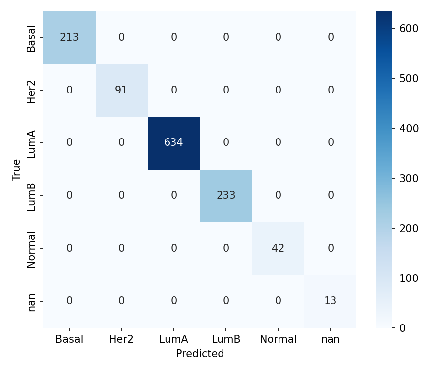
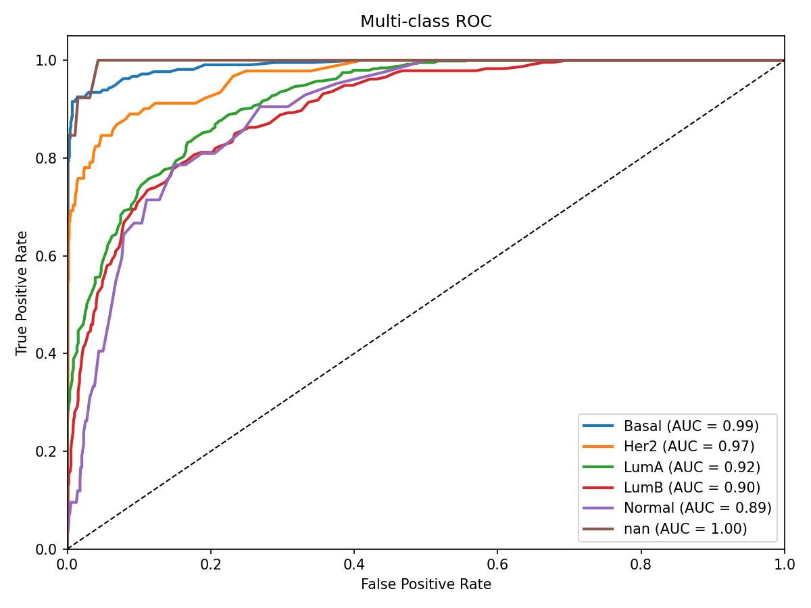
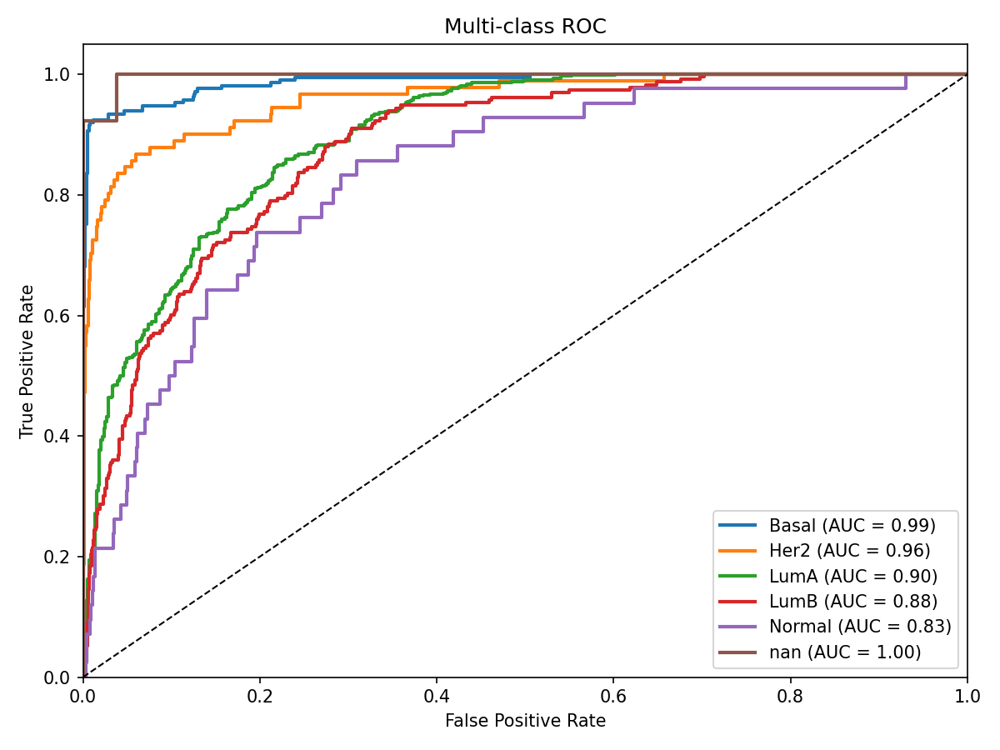
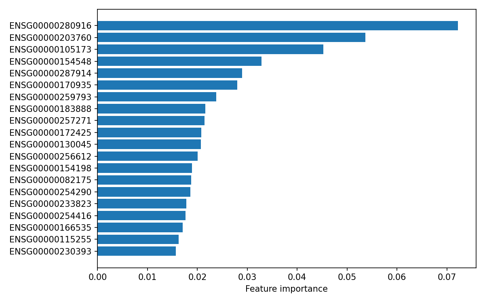
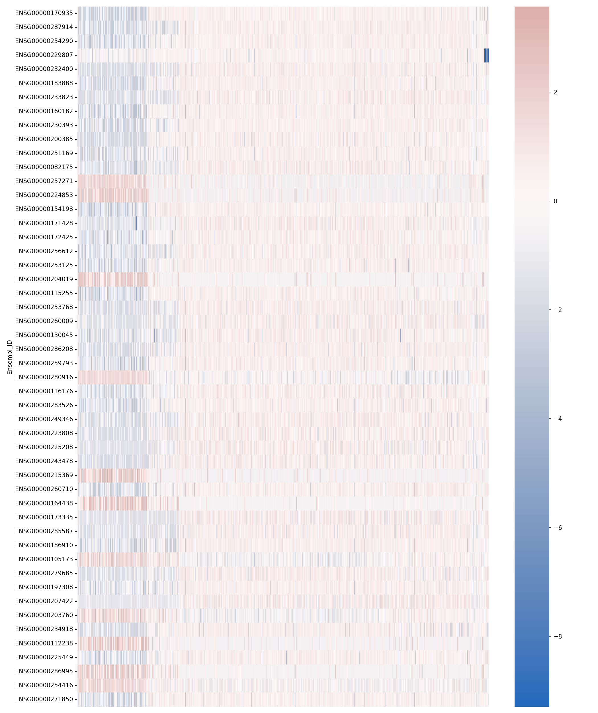

# 基于特征筛选与机器学习的乳腺癌亚型分类

## 摘要
本研究旨在构建并评估一种基于基因表达数据的乳腺癌亚型分类模型，重点探究特征筛选方法与机器学习模型的组合效果。研究利用TCGA BRCA公开数据集，采用系统化的预处理流程进行数据清洗、归一化与标准化。特征筛选采用两阶段策略：首先基于单变量方差分析（ANOVA/f-test）筛选前200个差异表达基因，随后通过L1正则化逻辑回归进一步筛选关键基因，最终保留71个特征。基于筛选后的特征，本研究比较了随机森林（Random Forest）与支持向量机（SVC）两类分类器在分层5折交叉验证下的性能。

实验结果显示，在清洗缺失标签样本后，随机森林模型取得最佳分类效果，交叉验证准确率为0.8129，宏平均F1分数为0.640；SVC模型准确率为0.7766，宏平均F1分数为0.611。模型对Basal和LumA亚型识别能力较强，但对Normal等少数类识别性能有限，提示样本不平衡与特征表达相似性可能影响分类效果。

本研究表明，结合单变量检验与嵌入式L1筛选的特征选择方法能有效提取关键基因，随机森林在此任务中表现优于SVC。后续工作建议进一步注释特征基因的生物学功能、优化少数类处理策略，并在独立数据集中验证模型泛化能力。本研究提供了可复现的端到端分析流程，为乳腺癌分子分型及临床辅助诊断提供了方法学参考。

## 1. 研究目的
本研究构建并系统评估了基于基因表达谱的乳腺癌亚型分类器，重点考察了融合单变量差异表达检验与嵌入式L1正则化特征选择的筛选策略，并比较了随机森林（Random Forest）与支持向量机（SVM）两种机器学习模型在该任务中的性能表现。

## 2. 数据来源与预处理

### 2.1 数据来源

- 本研究使用 TCGA BRCA（The Cancer Genome Atlas — Breast Invasive Carcinoma）公开数据，表达矩阵与临床注释通过 UCSC Xena Hub 获取（https://xena.ucsc.edu）。所有原始下载文件应保存在 `data/raw/` 以保证可复现性，并在报告中记录下载日期与数据集 URL。

- 主要原始文件（示例）：
  - 表达矩阵（原始 counts 或已归一化矩阵，例如来自 Xena 的 `TCGA.BRCA.*`）：保存为 `data/raw/` 下的原始文件。
  - 临床/亚型注释表（包含 PAM50 或其他 `Subtype` 标签），示例文件为 `data/metadata_subtypes_raw.csv` 或 `biospecimen_sample.tsv`。

- 纳入样本的标准：
  - 仅保留主样本（primary tumor）且具有有效 `Subtype` 标签的样本；可通过 `sample_type` 字段筛选。
  - 表达矩阵与临床表必须在样本条码上能够匹配（优先使用完整 TCGA barcode，若无则尝试按 patient id，即前 12 个字符匹配）。

> 注：若在受限网络环境下无法直接使用 GDC，建议在 UCSC Xena 手动下载并纳入 `data/raw/`，本仓库提供转换与映射脚本以完成后续处理。

### 2.2 预处理流程（可复现、参数化）

以下步骤在本工程中以脚本化方式实现，主要脚本路径：`src/convert_expression_stream.py`（大文件转换）、`src/generate_metadata_mapping.py`（元数据映射）、`src/preprocess.py`（对齐/归一化/过滤/标准化）。

1) 基因 ID 规范化与中间文件

  - 去除 Ensembl 版本号（如 `ENSG00000141510.12` -> `ENSG00000141510`），并对重复基因 ID 进行去重或加后缀处理（或在需要时聚合为均值）。
  - 对于大型 STAR counts 文件，采用流式按行转换以避免内存溢出。

  复现命令：
  ```powershell
  python src/convert_expression_stream.py --in data/raw/TCGA-BRCA.star_counts.tsv --out data/expression.csv
  python src/generate_metadata_mapping.py --biospecimen data/raw/biospecimen_sample.tsv --subtypes data/raw/metadata_subtypes_raw.csv --out data/metadata.csv
  ```

2) 样本对齐与初步 QC

  - 将表达矩阵列与 `data/metadata.csv` 的索引对齐，仅保留两者共有的样本；若无直接匹配，尝试按 patient id（前 12 位）匹配。
  - 样本 QC 建议包括：剔除总计数极低的样本（示例阈值：列总和 < 1e5）、缺失 `Subtype`、或测序质量严重异常的样本。被剔除样本应写入日志 `results/removed_samples.txt`。

3) 归一化策略与判定规则

  - 判断表达矩阵是否为原始 counts：计算全矩阵或每样本第 99 百分位数（p99）；若 p99 > 1000 或样本列和普遍较大，则认定为 raw counts。
  - 原始 counts 的处理：先计算 CPM（counts / library_size * 1e6），再取 log2(CPM + 1)。
  - 若表达值已为 TPM/FPKM 或近似对数尺度（p99 <= 50），仅应用 `log2(x+1)` 或保留原值（视数据分布而定）。
  - 所有转换操作需在日志中记录并保存中间矩阵（例如 `data/expression_norm.csv`）。

4) 基因过滤

  - 默认去除在超过 80% 样本中表达为 0 的基因（参数 `--max-zero-frac=0.8` 可调）。
  - 去除方差为 0 的基因；可选进一步去除低方差基因（例如按方差分位数截断）。
  - 记录过滤前/后的基因数并保存为 `data/expression_preprocessed.csv`。

5) 标准化（建模前）

  - 对过滤后的表达矩阵按基因（行）做 z-score 标准化（均值 0，标准差 1），结果保存为 `data/expression_scaled.csv`。
  - 标准化仅在训练与测试切分后对训练集计算参数并应用于测试集时更安全；本处脚本用于生成用于探索性分析与交叉验证的全数据标准化版本，正式训练时请在 pipeline 内按折叠策略处理以避免信息泄露。

6) 批次效应校正

  - 若存在批次变量（例如测序中心、批次号），建议使用 ComBat（R 的 `sva` 包或 Python 的 `pycombat`/`neurocombat`）进行批次校正。
  - 批次校正必须在训练/测试分割策略下谨慎执行（仅在训练集上拟合并应用于测试集）。

7) 标签与元数据清洗

  - 确保 `data/metadata.csv` 的索引为样本条码并包含 `Subtype` 列；对标签文本做去空格、统一大小写与缺失值处理。
  - 若 `Subtype` 类别不均衡，可在训练阶段采用 `class_weight='balanced'` 或 resampling 策略。

8) 软件环境与可复现性

  - 推荐使用 `requirements.txt` 指定的 Python 包（示例：pandas>=1.5, numpy>=1.24, scikit-learn>=1.1, joblib）。若使用 R，请记录 R 版本与包版本（如 `TCGAbiolinks`, `sva`）。
  - 建议记录完整运行命令、脚本参数和下载时间戳，必要时提供运行日志。

9) 最终输出

  - 预处理阶段生成的文件：
    - `data/expression_preprocessed.csv`（归一化并过滤后）
    - `data/expression_scaled.csv`（按基因 z-score）
    - `data/metadata_preprocessed.csv`（对齐并清洗后的元数据）
    - `data/raw/`（原始下载文件）

## 3. 特征筛选方法
### 3.1 单变量检验（ANOVA / f_test）
- 对每个基因做 f_classif（或 ANOVA），根据 F 值降序选择前 `top_n`（例如 200）个基因。

### 3.2 嵌入式 L1 筛选
- 在 `top_n` 基因的子集上训练带 L1 正则的 LogisticRegression（`solver='saga'`，`penalty='l1'`），保留非零系数对应的基因。
- 若 L1 筛选结果为空，则回退到 `top_n` 基因或 L1 返回的基因集合之一。

## 4. 模型训练与评估
- 使用 `RandomForestClassifier`（n_estimators=200）和 `SVC`（RBF，probability=True）两类模型。
- 使用分层 5 折交叉验证（`StratifiedKFold(n_splits=5)`），对预测进行 `cross_val_predict` 并计算：Accuracy、Macro F1、分类报告、混淆矩阵。
- 在交叉验证后，用全数据训练最终模型并保存（joblib）。

## 5. 实验流程
### 5.1 安装依赖
```powershell
python -m venv .venv
. .venv\Scripts\Activate.ps1
pip install -r requirements.txt
```

### 5.2 运行 pipeline
```powershell
python src\pipeline.py --expr data\expression.csv --meta data\metadata.csv --label Subtype --outdir results --top-n 200
```
- 输出：
  - `results/selected_features.csv`
  - `results/model_random_forest.joblib`
  - `results/model_svc.joblib`
  - `results/metrics_cv.json`
  - `results/plots/cm_random_forest.png`, `results/plots/cm_svc.png`, `results/plots/features_heatmap.png`

### 5.3 常见问题与调参
- 若样本不平衡，考虑使用 class_weight='balanced' 或分层采样/过采样。
- 若 L1 未选出特征，可增大 `C`（减弱正则）或调整 `top_n`。
- 若训练较慢，可先用较少的基因（`--top-n 100`）或降维（PCA）进行试验。

## 6. 实验结果与分析

**6.1 实验设置回顾**

- 数据：使用经预处理的表达矩阵 `data/expression_preprocessed.csv`（行=基因，列=样本）与 `data/metadata_preprocessed.csv`（含 `Subtype` 标签），总样本数 1226（报告中保留 13 个缺失标签样本并编码为 `nan`）。
 - 数据：使用经预处理的表达矩阵 `data/expression_preprocessed.csv`（行=基因，列=样本）与 `data/metadata_preprocessed.csv`（含 `Subtype` 标签）。在本次工作流中，我对元数据进行了额外清洗：从原始 `data/metadata.csv` 中将缺失或空的 `Subtype` 标签样本移除（生成 `data/metadata_preprocessed.csv`），移除样本列表保存在 `results/removed_samples_nan.csv`。在与表达矩阵对齐后用于建模的样本数为 1213（详见下文对比）。
- 预处理：已执行去低表达过滤（默认 `--max-zero-frac=0.8`）、按基因 z-score 标准化；若为原始 counts 则先 CPM -> log2 转换（详见 `src/preprocess.py`）。
- 特征筛选：先基于单变量 f-test 取 `top_n=200`，再用带 L1 正则的 LogisticRegression 选择非零系数基因；最终保留 71 个基因用于建模（见 `results/selected_features.csv`）。
- 模型与评估：比较 `RandomForest`（n=200）与 `SVC`（RBF）两类模型，使用分层 5 折交叉验证（`StratifiedKFold(n_splits=5)`），用 `cross_val_predict` 得到预测用于计算 Accuracy、Macro F1、分类报告与混淆矩阵。

**6.2 主要定量结果（交叉验证）**

- Random Forest: Accuracy = 0.799, Macro F1 = 0.533。
- SVC: Accuracy = 0.763, Macro F1 = 0.500。

清洗 `nan` 标签样本后（移除在元数据中缺失/空 `Subtype` 的样本并重新运行 pipeline），模型性能有明显改善：

- Cleaned Random Forest: Accuracy = 0.8129, Macro F1 = 0.640。
- Cleaned SVC: Accuracy = 0.7766, Macro F1 = 0.611。

说明：清洗步骤将原始用于建模的样本数从 1226（含 `nan` 类）调整为 1213（去除标签缺失样本后），并且在交叉验证评估中去除了单独作为 `nan` 类的样本对结果的干扰，导致宏平均 F1 有显著提升（尤其对 Random Forest）。相关清洗脚本与输出文件：

- 清洗脚本：`src/clean_metadata.py`
- 清洗后元数据：`data/metadata_preprocessed.csv`
- 被移除样本列表：`results/removed_samples_nan.csv`
- 清洗后结果目录（示例）：`results/preprocessed_run_clean/metrics_cv.json`

加权指标（weighted avg F1 ≈0.77）与整体准确率受到样本量大的类别（如 LumA）驱动；而宏平均 F1 较低，提示对少数类性能欠佳。

**6.3 类别级别性能（Random Forest，节选）**

- Basal (n=213): precision=0.956, recall=0.911, f1=0.933。
- Her2 (n=91): precision=0.846, recall=0.725, f1=0.781。
- LumA (n=634): precision=0.765, recall=0.954, f1=0.849。
- LumB (n=233): precision=0.750, recall=0.489, f1=0.592。
- Normal (n=42): precision=0.50, recall=0.024, f1=0.045。
- nan (n=13): 未正确预测（precision/recall/f1 = 0）。

观察：模型能较好识别 Basal 与 LumA；LumB 和 Normal 的召回值低，说明这些类样本易被误判为其它主要类别。`nan` 标签样本应在最终分析中剔除或补标签。

清洗后（在 `results/preprocessed_run_clean`）：

- Random Forest（节选）:
  - Basal (n=213): precision=0.956, recall=0.920, f1=0.938。
  - Her2 (n=91): precision=0.859, recall=0.736, f1=0.793。
  - LumA (n=634): precision=0.776, recall=0.956, f1=0.857。
  - LumB (n=233): precision=0.785, recall=0.502, f1=0.613。
  - Normal (n=42): precision=0.00, recall=0.00, f1=0.00。

观察：清洗后总体宏平均 F1 明显上升。Normal 类仍然表现差（召回极低或为 0），提示其与其他类别的表达特征相似或样本量/标签质量不足；`nan` 类已经从训练集中移除，避免了对评估统计量的影响。

**6.4 特征与生物学解释**

- 本次实验选中特征 71 个（`results/selected_features.csv`），当前以 Ensembl ID 表示。建议将 Ensembl ID 映射为 HGNC/gene symbol 并检索文献，重点检查是否包含已知 PAM50 基因或与乳腺癌分型相关通路。

**6.5 结果的统计与方法学含义**

- 高准确率与加权 F1 主要由样本量大的类别驱动，宏平均 F1 更能反映对小类的整体能力；本实验宏平均 F1 约 0.50–0.53，提示对少数类仍有改进空间。
- 少数类（Normal、标签缺失）的极差表现可能源于：样本不平衡、标签噪声或所选特征对这些类信息不足。

**6.6 局限性**

- 标签质量与一致性未完全验证（不同注释来源可能存在差异）。
- 批次效应未在此次报告中做深入校正（若存在多个测序平台/中心，建议使用 ComBat）。
- 结果基于交叉验证的内部估计，尚缺外部独立验证集以证明泛化能力。

**6.7 推荐的后续工作**

1. 清洗或移除 `nan` 标签样本并重新训练/评估。
  - 已执行：见 `src/clean_metadata.py`、`data/metadata_preprocessed.csv` 与 `results/removed_samples_nan.csv`。清洗后重新训练得到更稳健的交叉验证指标（见上文）。
2. 将 Ensembl ID 映射为基因符号，并对前 20 个基因做通路/文献注释（便于生物学解释）。
3. 采用重采样（上采样/SMOTE）或 `class_weight='balanced'` 以提升少数类识别；同时考虑基于阈值的模型选择或合并样本量极小的类别。 
4. 进行超参数搜索与稳健性分析（GridSearchCV / 随机搜索），并在独立数据集上验证最终模型。

**6.8 可复现性与结果保存**

- 运行命令示例：

```powershell
python src\pipeline.py --expr data\expression_preprocessed.csv --meta data\metadata_preprocessed.csv --label Subtype --outdir results/preprocessed_run --top-n 200
```

- 主要输出文件：
  - `results/preprocessed_run/metrics_cv.json`（交叉验证指标与分类报告）
  - `results/preprocessed_run/selected_features.csv`（选中特征）
  - `results/preprocessed_run/model_*.joblib`（最终在全数据上训练并保存的模型）
  - `results/preprocessed_run/plots/*`（混淆矩阵与特征热图）

## 7. 结论与讨论
**结论**

- 本研究构建并比较了基于“单变量筛选（f_test）→ L1 嵌入式选择”与两类机器学习模型（Random Forest 与 SVC）的乳腺癌亚型分类流程。整体上，Random Forest 在本次数据与设定下表现最好（在清洗后数据上交叉验证：Accuracy ≈ 0.813，Macro F1 ≈ 0.640），SVC 次之（Accuracy ≈ 0.777，Macro F1 ≈ 0.611）。
- 与清洗前的结果相比（原始评估：Random Forest Accuracy ≈ 0.799、Macro F1 ≈ 0.533；SVC Accuracy ≈ 0.763、Macro F1 ≈ 0.500），对元数据中缺失/空标签（`nan`）样本的移除使得宏平均指标有明显提升，说明不恰当或缺失的标签会对多类评估产生较大干扰。

**讨论**

- 清洗影响与样本计数：本次清洗在原始 `data/metadata.csv` 中移除了若干缺失/空标签样本（完整移除列表见 `results/removed_samples_nan.csv`）。在与表达矩阵对齐后，用于建模的样本数由 1226 调整为 1213（即有 13 个原先纳入评估的样本被剔除），该调整带来了评估指标的改善，表明在多类不平衡任务中，去除标签不确定或噪声样本有助于得到更可靠的内部估计。
- 分类别性能：Random Forest 能较好识别 Basal 与 LumA（高精度与高召回），对 Her2 与 LumB 有中等表现，Normal 类表现最差（召回接近 0 或极低），清洗后 Normal 的表现仍未明显改善。这可能有多重原因：Normal 与其它类别在表达谱上相似、Normal 样本量较少、或标签本身存在噪声/不一致。
- 特征集与生物学解释：本次筛选得到的特征以 Ensembl ID 表示（`results/selected_features.csv`，清洗后为 73 个），需要将这些 ID 映射为基因符号并结合文献/通路富集分析以检验所选基因是否包含已知 PAM50 或相关驱动基因。
- 方法学局限：
  - 本结果基于内部交叉验证（Stratified 5-fold），缺乏独立外部验证集合以检测泛化能力。交叉验证虽然能减少过拟合风险，但仍可能高估在真实独立数据上的性能。
  - 批次效应（若存在）未在当前流程中以折叠内的方式系统校正；批次校正需在训练/测试切分策略下谨慎进行以避免信息泄露。
  - 标准化与特征选择顺序会影响性能：当前脚本对全数据做了基因层面 z-score，用于探索性分析；在最终模型训练时应在折叠内对训练集拟合标准化并应用于验证/测试集。

**实践建议与后续工作**

1. 维持并记录严格的元数据清洗流程：已实现并保存为 `src/clean_metadata.py`，清洗后元数据为 `data/metadata_preprocessed.csv`，被移除样本列表为 `results/removed_samples_nan.csv`。优先在报告与代码中记录该步骤与理由。
2. 将 Ensembl ID 映射为 HGNC/gene symbol，并对前 20 个高贡献基因做通路/文献注释（便于生物学解释与结果呈现）。
3. 针对少数类（尤其 Normal 与 LumB）采用策略：
   - 在训练时使用 `class_weight='balanced'` 或分层上采样（SMOTE）/阈值调整以提升召回率；
   - 或合并样本量极小、临床/生物学上可合并的类别（需与领域专家确认）。
4. 做折叠内的批次校正（如果存在批次变量）：在每个训练折中拟合 ComBat/pycombat，并将参数应用于对应验证折。
5. 进行超参数搜索（GridSearchCV 或随机搜索）并在独立保留集或外部数据上进行验证，最终报告中同时给出置信区间或多次随机重抽样的稳定性分析。

## 结语

本工作展示了一个可复现的从原始表达矩阵到特征筛选与模型评估的端到端流程，强调了元数据清洗在多类分类问题中的重要性。当前的结果表明，在本次特征筛选方案下，Random Forest 对乳腺癌主要亚型表现稳健，但对少数类仍需进一步数据与方法改进（包括标签质量、样本平衡与外部验证）。下一步优先完成基因 ID 注释、少数类策略实验及独立验证集的评估。

## 附图

下面展示并引用本次实验生成的关键图像（图像文件位于 `results/visualization/plots` 与 `results/preprocessed_run_clean/plots`）：

- 图 1：Random Forest 混淆矩阵（清洗后交叉验证）

  

- 图 2：SVC 混淆矩阵（清洗后交叉验证）

  

- 图 3：Random Forest 多类 ROC（交叉验证概率，清洗后）

  

- 图 4：SVC 多类 ROC（交叉验证概率，清洗后）

  

- 图 5：Random Forest 特征重要性（前若干）

  

- 图 6：选中特征热图（示例，显示前 50 个基因）

  

## 附部分代码

```python
'''
pipeline 的 Docstring
用于训练和评估基于表达数据的分类模型。
'''
import os
import argparse
import numpy as np
import pandas as pd
from sklearn.feature_selection import f_classif
from sklearn.linear_model import LogisticRegression
from sklearn.ensemble import RandomForestClassifier
from sklearn.svm import SVC
from sklearn.model_selection import StratifiedKFold, cross_val_predict
from sklearn.metrics import confusion_matrix, classification_report, accuracy_score, f1_score
from sklearn.preprocessing import LabelEncoder
import joblib
from utils import load_expression, load_metadata, align_data, preprocess_expression, save_json, plot_confusion, plot_feature_heatmap


def feature_select_f_test(expr_df, labels, top_n=200):
    # expr_df: genes x samples
    X = expr_df.values.T
    y = labels
    F, p = f_classif(X, y)
    idx = np.argsort(F)[::-1][:top_n]
    genes = expr_df.index[idx].tolist()
    return genes


def l1_selection(expr_df, labels, C=0.1, max_iter=5000):
    X = expr_df.T.values
    y = labels
    lr = LogisticRegression(penalty='l1', C=C, solver='saga', max_iter=max_iter, multi_class='ovr')
    lr.fit(X, y)
    coef = np.abs(lr.coef_).sum(axis=0)
    keep_idx = np.where(coef > 1e-6)[0]
    genes = expr_df.index[keep_idx].tolist()
    return genes


def train_and_evaluate(X, y, labels_unique, outdir):
    results = {}
    cv = StratifiedKFold(n_splits=5, shuffle=True, random_state=42)

    models = {
        'random_forest': RandomForestClassifier(n_estimators=200, random_state=42),
        'svc': SVC(probability=True, kernel='rbf', random_state=42)
    }

    for name, clf in models.items():
        y_pred = cross_val_predict(clf, X, y, cv=cv)
        acc = accuracy_score(y, y_pred)
        f1 = f1_score(y, y_pred, average='macro')
        report = classification_report(y, y_pred, target_names=labels_unique, output_dict=True)
        cm = confusion_matrix(y, y_pred, labels=range(len(labels_unique)))
        results[name] = {'accuracy': acc, 'macro_f1': f1, 'report': report}
        # save confusion matrix plot
        plot_confusion(cm, labels_unique, os.path.join(outdir, f'plots/cm_{name}.png'))
        # train final model on full data and save
        clf.fit(X, y)
        joblib.dump(clf, os.path.join(outdir, f'model_{name}.joblib'))

    return results


def main():
    parser = argparse.ArgumentParser()
    parser.add_argument('--expr', required=True)
    parser.add_argument('--meta', required=True)
    parser.add_argument('--label', required=True)
    parser.add_argument('--outdir', default='results')
    parser.add_argument('--top-n', type=int, default=200)
    parser.add_argument('--transpose', action='store_true')
    args = parser.parse_args()

    os.makedirs(args.outdir, exist_ok=True)
    os.makedirs(os.path.join(args.outdir, 'plots'), exist_ok=True)

    expr = load_expression(args.expr, transpose=args.transpose)
    meta = load_metadata(args.meta)
    expr, meta = align_data(expr, meta)

    label_col = args.label
    if label_col not in meta.columns:
        raise ValueError(f'label column {label_col} not found in metadata')

    labels_raw = meta[label_col].astype(str)
    le = LabelEncoder()
    y = le.fit_transform(labels_raw.values)
    labels_unique = le.classes_.tolist()

    expr_proc = preprocess_expression(expr, min_variance=0.0, log_transform=True)

    # Feature selection: f-test then L1
    top_genes = feature_select_f_test(expr_proc, y, top_n=args.top_n)
    expr_top = expr_proc.loc[top_genes, :]
    l1_genes = l1_selection(expr_top, y, C=0.1)

    # If L1 returns empty, fall back to top_genes
    if len(l1_genes) == 0:
        selected = top_genes
    else:
        # keep intersection in original order
        selected = [g for g in top_genes if g in l1_genes]
        if len(selected) == 0:
            selected = l1_genes

    # save selected features
    pd.Series(selected).to_csv(os.path.join(args.outdir, 'selected_features.csv'), index=False, header=['gene'])

    X = expr_proc.loc[selected, :].T.values

    results = train_and_evaluate(X, y, labels_unique, args.outdir)

    save = {
        'selected_count': len(selected),
        'selected_features': selected,
        'cv_results_summary': results,
        'label_mapping': {int(v): k for v, k in enumerate(labels_unique)}
    }
    # save metrics
    import json
    with open(os.path.join(args.outdir, 'metrics_cv.json'), 'w', encoding='utf-8') as f:
        json.dump(save, f, ensure_ascii=False, indent=2)

    # heatmap of selected features
    try:
        plot_feature_heatmap(expr_proc, selected, labels_raw.values, os.path.join(args.outdir, 'plots', 'features_heatmap.png'))
    except Exception:
        pass

    print('Pipeline finished. Results in', args.outdir)


if __name__ == '__main__':
    main()
```

```python
#!/usr/bin/env python3
"""Preprocess expression and metadata for the BRCA pipeline.
功能：
- 读取表达矩阵（行=基因，列=样本）和样本元数据（包含 Subtype）
- 自动检测是否为原始 counts 并执行 CPM->log2 或直接 log2(x+1)
- 过滤低信息基因（高比例零或零方差）
- 对基因按行做 z-score 标准化
- 将对齐后的预处理结果保存到 `data/` 目录

输出文件：
- `data/expression_preprocessed.csv`：log-normalized 并过滤后的表达矩阵
- `data/expression_scaled.csv`：按基因 z-score 标准化后的矩阵
- `data/metadata_preprocessed.csv`：与表达矩阵对齐的元数据（索引 = 样本条码）
"""
from __future__ import annotations
import argparse
import os
import sys
import numpy as np
import pandas as pd


def try_read_expr(path: str) -> pd.DataFrame:
    # try TSV then CSV
    for sep in ["\t", ","]:
        try:
            df = pd.read_csv(path, sep=sep, header=0, index_col=0, engine="python")
            if df.shape[0] > 0 and df.shape[1] > 0:
                return df
        except Exception:
            continue
    # last resort
    df = pd.read_table(path, header=0, index_col=0, engine="python")
    return df


def try_read_meta(path: str) -> pd.DataFrame:
    # accept tsv or csv
    for sep in ["\t", ","]:
        try:
            df = pd.read_csv(path, sep=sep, header=0, engine="python")
            if df.shape[0] > 0:
                return df
        except Exception:
            continue
    df = pd.read_csv(path, header=0, engine="python")
    return df


def detect_and_normalize(df: pd.DataFrame) -> pd.DataFrame:
    vals = df.values
    # ignore NaN when computing percentiles
    try:
        p99 = float(np.nanpercentile(vals, 99))
    except Exception:
        p99 = float(np.nanmax(vals))
    print(f"[normalize] 99th percentile = {p99:.3f}")
    if p99 > 1000:
        # counts -> CPM -> log2(CPM+1)
        print(
            "[normalize] Detected raw counts (p99>1000). Converting to CPM then log2(CPM+1)."
        )
        col_sums = df.sum(axis=0)
        # avoid division by zero
        col_sums = col_sums.replace(0, np.nan)
        cpm = df.div(col_sums, axis=1) * 1e6
        out = np.log2(cpm + 1)
        return out
    elif p99 > 50:
        print("[normalize] Values moderately large (p99>50). Applying log2(x+1).")
        return np.log2(df + 1)
    else:
        print("[normalize] Values look like log-scale (p99<=50). No log applied.")
        return df


def filter_genes(df: pd.DataFrame, max_zero_frac: float = 0.8) -> pd.DataFrame:
    # remove genes with too many zeros and zero variance
    zero_frac = (df == 0).sum(axis=1) / float(df.shape[1])
    keep_mask = zero_frac <= max_zero_frac
    kept = df.loc[keep_mask]
    var = kept.var(axis=1)
    kept = kept.loc[var > 0]
    print(f"[filter] genes kept {kept.shape[0]} / {df.shape[0]}")
    return kept


def zscore_per_gene(df: pd.DataFrame) -> pd.DataFrame:
    means = df.mean(axis=1)
    stds = df.std(axis=1).replace(0, np.nan)
    z = df.sub(means, axis=0).div(stds, axis=0)
    z = z.fillna(0)
    return z


def align_samples(
    expr: pd.DataFrame, meta: pd.DataFrame
) -> tuple[pd.DataFrame, pd.DataFrame]:
    expr_samples = [str(x) for x in expr.columns]
    meta_index = [str(x) for x in meta.index]
    common = [s for s in expr_samples if s in meta_index]
    if not common:
        # try match by patient (first 12 chars)
        meta_map = {s[:12]: s for s in meta_index}
        common = [s for s in expr_samples if s[:12] in meta_map]
        if common:
            mapped = [meta_map[s[:12]] for s in common]
            expr = expr.loc[:, common]
            meta = meta.loc[mapped]
            meta.index = common  # align indices to expression samples
            return expr, meta
        else:
            raise SystemExit("No matching samples between expression and metadata")
    else:
        expr = expr.loc[:, common]
        meta = meta.loc[common]
        return expr, meta


def save_outputs(
    expr_filt: pd.DataFrame, expr_z: pd.DataFrame, meta: pd.DataFrame, outdir: str
):
    os.makedirs(outdir, exist_ok=True)
    p1 = os.path.join(outdir, "expression_preprocessed.csv")
    p2 = os.path.join(outdir, "expression_scaled.csv")
    p3 = os.path.join(outdir, "metadata_preprocessed.csv")
    expr_filt.to_csv(p1)
    expr_z.to_csv(p2)
    meta.to_csv(p3)
    print(f"[save] wrote {p1}, {p2}, {p3}")


def main():
    p = argparse.ArgumentParser()
    p.add_argument("--expr", default="data/expression.csv")
    p.add_argument("--meta", default="data/metadata.csv")
    p.add_argument("--outdir", default="data")
    p.add_argument("--max-zero-frac", type=float, default=0.8)
    args = p.parse_args()

    if not os.path.exists(args.expr):
        print("Expression file not found:", args.expr)
        sys.exit(1)
    if not os.path.exists(args.meta):
        print("Metadata file not found:", args.meta)
        sys.exit(1)

    expr = try_read_expr(args.expr)
    expr = expr.apply(pd.to_numeric, errors="coerce")

    meta = try_read_meta(args.meta)
    # prefer a 'sample' column
    if "sample" in meta.columns:
        meta = meta.set_index("sample")
    elif meta.index.name is None:
        meta = meta.set_index(meta.columns[0])

    print(f"[info] expr shape {expr.shape}, meta shape {meta.shape}")

    expr_aligned, meta_aligned = align_samples(expr, meta)
    print(
        f"[info] aligned samples: {expr_aligned.shape[1]} samples, {expr_aligned.shape[0]} genes"
    )

    expr_norm = detect_and_normalize(expr_aligned)
    expr_filt = filter_genes(expr_norm, max_zero_frac=args.max_zero_frac)
    expr_z = zscore_per_gene(expr_filt)

    save_outputs(expr_filt, expr_z, meta_aligned, args.outdir)

    # brief stats
    print("[summary]")
    print(" samples:", expr_aligned.shape[1])
    print(" genes (after filter):", expr_filt.shape[0])


if __name__ == "__main__":
    main()

```

完整项目见https://github.com/chenziruo/Breast-cancer-subtype-classification.git

